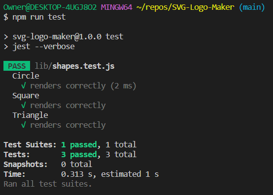
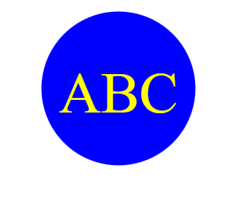

# SVG Logo Maker

## Description

This challenge is to build a Node.js command-line application that takes in user input to generate a logo and save it as an SVG file. The application prompts the user to select a color and shape, provide text for the logo, and save the generated SVG to a `.svg` file.

The application has: `Triangle`, `Square`, and `Circle` classes.

Each shape class is tested for a `render()` method that returns a string for the corresponding SVG file with the given shape color.

## User Specifications

AS a freelance web developer, the developer wants to generate a simple logo for projects to avoid paying a graphic designer.

## Functionality

Given a command-line application that accepts user input, when the user is prompted for text, the user can enter up to three characters

When the user is prompted for the text color, the use can enter a color keyword (OR a hexadecimal number) for the text color.

When the user is prompted for a shape, the user is presented with a list of shapes to choose from: circle, triangle, and square.

When the user is prompted for the shape's color, the user can enter a color keyword (OR a hexadecimal number) for the shape color.

When the user has entered input for all the prompts, an SVG file is created named `logo.svg`
and the output text "Generated logo.svg" is printed in the command line

When the user opens `logo.svg` file in a browser, the user is shown a 300x200 pixel image that matches the criteria I entered

## Mock-Up

The following image shows a mock-up of the generated SVG given the following input entered by the user: `SVG` for the text, `white` for the text color, `circle` from the list of shapes, and `green` for the shape color. Note that this is just an image of the output SVG and not the SVG file itself:

## Walkthrough

 A walkthrough video that demonstrates the functionality of the SVG logo maker and passing tests has been submitted (see deliverables below for link)

 The walkthrough video shows all tests passing from the command line.
 
 

 The walkthrough video demonstrates how a user would invoke the application from the command line.

The walkthrough video demonstrates how a user would enter responses to all of the prompts in the application.

The walkthrough video demonstrates a generated SVG file, showing the file being opened in the browser. The image in the browser reflects the choices made by the user (text, shape, and colors).

## Appearance, sample SVG files generated:

Circle.

Square.

Triangle.
## Deliverables

The following walkthrough video demonstrates the functionality of the application and passing tests:
https://watch.screencastify.com/v/NEcDs1zwj6aJRbz8WNlh

The URL of the GitHub repository: https://github.com/dawn-kline-m/SVG-Logo-Maker

